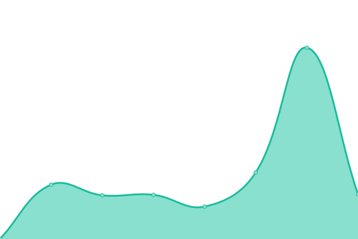
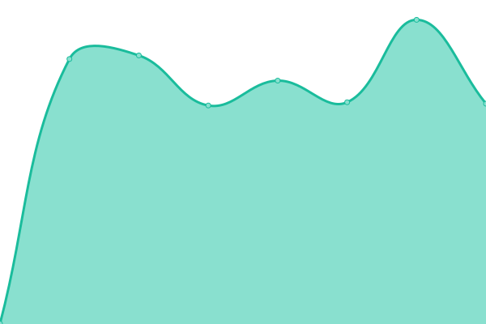
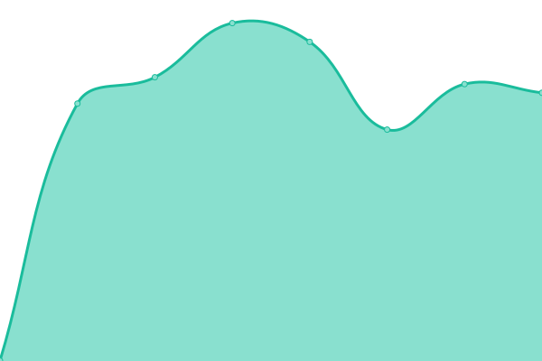
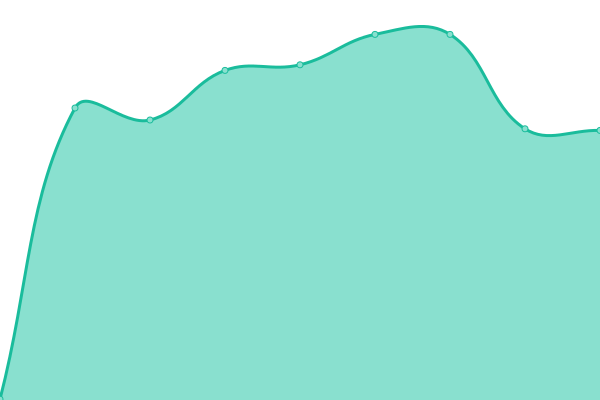

# [📈 Live Status](https://steve-icreationslab.github.io/ICL_ServerMonitor): <!--live status--> **🟩 All systems operational**

This repository contains the open-source uptime monitor and status page for [steve-icreationslab](https://steve-icreationslab.github.io/ICL_ServerMonitor), powered by [Upptime](https://github.com/upptime/upptime).

With [Upptime](https://upptime.js.org), you can get your own unlimited and free uptime monitor and status page, powered entirely by a GitHub repository. We use [Issues](https://github.com/steve-icreationslab/ICL_ServerMonitor/issues) as incident reports, [Actions](https://github.com/steve-icreationslab/ICL_ServerMonitor/actions) as uptime monitors, and [Pages](https://steve-icreationslab.github.io/ICL_ServerMonitor) for the status page.

<!--start: status pages-->
<!-- This summary is generated by Upptime (https://github.com/upptime/upptime) -->
<!-- Do not edit this manually, your changes will be overwritten -->
<!-- prettier-ignore -->
| URL | Status | History | Response Time | Uptime |
| --- | ------ | ------- | ------------- | ------ |
|  DS - AllGreen | 🟩 Up | [ds-all-green.yml](https://github.com/steve-icreationslab/ICL_ServerMonitor/commits/HEAD/history/ds-all-green.yml) | 

 629ms
     
 | 

<a href="https://steve-icreationslab.github.io/ICL_ServerMonitor/history/ds-all-green">100.00%</a>
    

|  DS - ICL Main 1 OLD | 🟩 Up | [ds-icl-main-1-old.yml](https://github.com/steve-icreationslab/ICL_ServerMonitor/commits/HEAD/history/ds-icl-main-1-old.yml) | 

 666ms
     
 | 

<a href="https://steve-icreationslab.github.io/ICL_ServerMonitor/history/ds-icl-main-1-old">100.00%</a>
    

|  DS - ICL Main 2 OLD | 🟩 Up | [ds-icl-main-2-old.yml](https://github.com/steve-icreationslab/ICL_ServerMonitor/commits/HEAD/history/ds-icl-main-2-old.yml) | 

 653ms
     
 | 

<a href="https://steve-icreationslab.github.io/ICL_ServerMonitor/history/ds-icl-main-2-old">100.00%</a>
    

|  DS - ICL MAIN 1 NEW | 🟩 Up | [ds-icl-main-1-new.yml](https://github.com/steve-icreationslab/ICL_ServerMonitor/commits/HEAD/history/ds-icl-main-1-new.yml) | 

 395ms
     
 | 

<a href="https://steve-icreationslab.github.io/ICL_ServerMonitor/history/ds-icl-main-1-new">100.00%</a>
    

|  DS - SHF | 🟩 Up | [ds-shf.yml](https://github.com/steve-icreationslab/ICL_ServerMonitor/commits/HEAD/history/ds-shf.yml) | 

 463ms
     
 | 

<a href="https://steve-icreationslab.github.io/ICL_ServerMonitor/history/ds-shf">100.00%</a>
    

|  DS - KUOKGROUP | 🟩 Up | [ds-kuokgroup.yml](https://github.com/steve-icreationslab/ICL_ServerMonitor/commits/HEAD/history/ds-kuokgroup.yml) | 

 733ms
     
 | 

<a href="https://steve-icreationslab.github.io/ICL_ServerMonitor/history/ds-kuokgroup">100.00%</a>
    

|  ICreationsLab Backup Server | 🟩 Up | [i-creations-lab-backup-server.yml](https://github.com/steve-icreationslab/ICL_ServerMonitor/commits/HEAD/history/i-creations-lab-backup-server.yml) | 

 723ms
     
 | 

<a href="https://steve-icreationslab.github.io/ICL_ServerMonitor/history/i-creations-lab-backup-server">100.00%</a>
    

|  VPS - EA | 🟩 Up | [vps-ea.yml](https://github.com/steve-icreationslab/ICL_ServerMonitor/commits/HEAD/history/vps-ea.yml) | 

 398ms
     
 | 

<a href="https://steve-icreationslab.github.io/ICL_ServerMonitor/history/vps-ea">100.00%</a>
    

|  VPS - ICL | 🟩 Up | [vps-icl.yml](https://github.com/steve-icreationslab/ICL_ServerMonitor/commits/HEAD/history/vps-icl.yml) | 

 684ms
     
 | 

<a href="https://steve-icreationslab.github.io/ICL_ServerMonitor/history/vps-icl">100.00%</a>
    

|  VPS - OAS | 🟩 Up | [vps-oas.yml](https://github.com/steve-icreationslab/ICL_ServerMonitor/commits/HEAD/history/vps-oas.yml) | 

 396ms
     
 | 

<a href="https://steve-icreationslab.github.io/ICL_ServerMonitor/history/vps-oas">100.00%</a>
    

|  VPS - SDF | 🟩 Up | [vps-sdf.yml](https://github.com/steve-icreationslab/ICL_ServerMonitor/commits/HEAD/history/vps-sdf.yml) | 

 749ms
     
 | 

<a href="https://steve-icreationslab.github.io/ICL_ServerMonitor/history/vps-sdf">100.00%</a>
    

|  VPS - TET | 🟩 Up | [vps-tet.yml](https://github.com/steve-icreationslab/ICL_ServerMonitor/commits/HEAD/history/vps-tet.yml) | 

 670ms
     
 | 

<a href="https://steve-icreationslab.github.io/ICL_ServerMonitor/history/vps-tet">100.00%</a>
    

|  VPS-MOBY | 🟩 Up | [vps-moby.yml](https://github.com/steve-icreationslab/ICL_ServerMonitor/commits/HEAD/history/vps-moby.yml) | 

 397ms
     
 | 

<a href="https://steve-icreationslab.github.io/ICL_ServerMonitor/history/vps-moby">100.00%</a>
    

|  VPS-MPP-EU1 | 🟩 Up | [vps-mpp-eu-1.yml](https://github.com/steve-icreationslab/ICL_ServerMonitor/commits/HEAD/history/vps-mpp-eu-1.yml) | 

 386ms
     
 | 

<a href="https://steve-icreationslab.github.io/ICL_ServerMonitor/history/vps-mpp-eu-1">100.00%</a>
    

|  VPS-RSAN | 🟩 Up | [vps-rsan.yml](https://github.com/steve-icreationslab/ICL_ServerMonitor/commits/HEAD/history/vps-rsan.yml) | 

 656ms
     
 | 

<a href="https://steve-icreationslab.github.io/ICL_ServerMonitor/history/vps-rsan">100.00%</a>
    

|  VPS-THHG | 🟩 Up | [vps-thhg.yml](https://github.com/steve-icreationslab/ICL_ServerMonitor/commits/HEAD/history/vps-thhg.yml) | 

 662ms
     
 | 

<a href="https://steve-icreationslab.github.io/ICL_ServerMonitor/history/vps-thhg">100.00%</a>
    

|  VPS-TIP | 🟩 Up | [vps-tip.yml](https://github.com/steve-icreationslab/ICL_ServerMonitor/commits/HEAD/history/vps-tip.yml) | 

 683ms
     
 | 

<a href="https://steve-icreationslab.github.io/ICL_ServerMonitor/history/vps-tip">100.00%</a>
    

<!--end: status pages-->

[**Visit our status website →**](https://steve-icreationslab.github.io/ICL_ServerMonitor)

## 📄 License

- Powered by: [Upptime](https://github.com/upptime/upptime)
- Code: [MIT](./LICENSE) © [Anand Chowdhary](https://anandchowdhary.com), supported by [Pabio](https://pabio.com)
- Data in the `./history` directory: [Open Database License](https://opendatacommons.org/licenses/odbl/1-0/)
